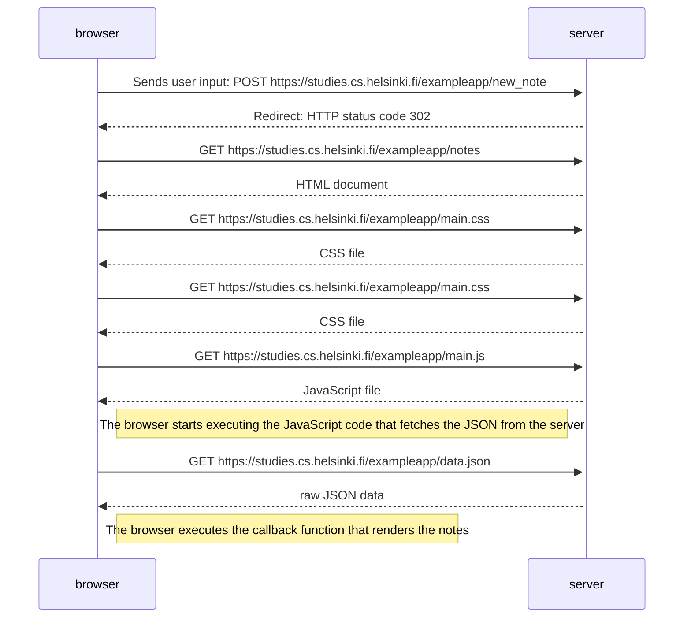

```mermaid

sequenceDiagram
    participant browser
    participant server

    browser->>+server: Sends user input: POST https://studies.cs.helsinki.fi/exampleapp/new_note
    server-->>browser: Redirect: HTTP status code 302

    browser->>server: GET https://studies.cs.helsinki.fi/exampleapp/notes
    server-->>browser: HTML document

    browser->>server: GET https://studies.cs.helsinki.fi/exampleapp/main.css
    server-->>browser: CSS file

    browser->>server: GET https://studies.cs.helsinki.fi/exampleapp/main.css
    server-->>browser: CSS file

    browser->>server: GET https://studies.cs.helsinki.fi/exampleapp/main.js
    server-->>browser: JavaScript file
    Note right of browser: The browser starts executing the JavaScript code that fetches the JSON from the server

    browser->>server: GET https://studies.cs.helsinki.fi/exampleapp/data.json
    server-->>browser: raw JSON data
    Note right of browser: The browser executes the callback function that renders the notes

```
