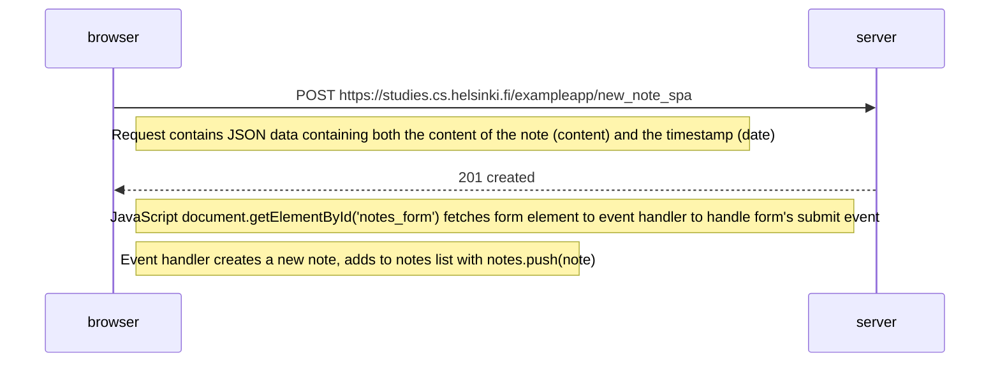

```mermaid

sequenceDiagram
    participant browser
    participant server

    browser->>server: POST https://studies.cs.helsinki.fi/exampleapp/new_note_spa
    Note right of browser: Request contains JSON data containing both the content of the note (content) and the timestamp (date)
    server-->>browser: 201 created

    Note right of browser: JavaScript document.getElementById('notes_form') fetches form element to event handler to handle form's submit event
    Note right of browser: Event handler creates a new note, adds to notes list with notes.push(note)

```
